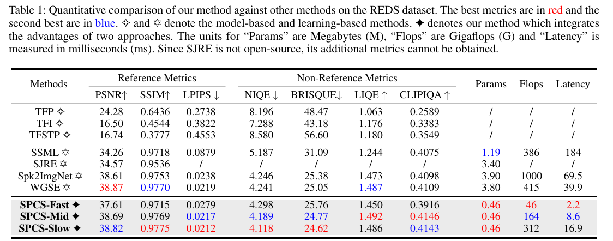

<h2 align="center"> 
  <a href="">Spike-Zoo: A Comprehensive Collection of Spike-based Image Reconstruction Methods
  </a>
</h2>
<h5 align="center"> 
If you like it, please give us a star ⭐ on GitHub.  
</h5>

<h5 align="center">

[](https://github.com/chenkang455/Spike-Image-Reconstruction/stargazers)&#160;
</h5>

<p align="center">
  
</p>


## 📕 Introduction 
This repository integrates various **spike-based image reconstruction methods**. It aims to assist in comparing and visualizing previous approaches on the standard REDS dataset, Real-world spike dataset, or a single spike sequence.

## 🎉 Updates

* **24-08-26:** We update the `SpikeFormer`<sup>[7]</sup> and `RSIR`<sup>[8]</sup> methods, the `UHSR`<sup>[9]</sup> dataset and the `piqe` non-reference metric.

* **24-07-19:** We release the Spike-Zoo base code.

## 🗓️ Todo
- [ ] Support more spike-based image reconstruction methods. (CVPR24 Zhao et al., TCSVT23 Zhao et al.) 
- [ ] Support more datasets. (CVPR24 Zhao et al., TCSVT23 Zhao et al.)
- [ ] Support more metrics. (More non-reference metrics.)
- [ ] Support more evaluation tools. (Evaluate the non-reference metrics of data.dat.)
</form>

## 🕶 Methods
In this repository, we currently support the following methods: `TFP`<sup>[1]</sup>, `TFI`<sup>[1]</sup>, `TFSTP`<sup>[2]</sup>, `Spk2ImgNet`<sup>[3]</sup>, `SSML`<sup>[4]</sup>, and `WGSE`<sup>[5]</sup>, which take 41 spike frames as the input and reconstruct one sharp image. We also support `SpikeFormer`<sup>[7]</sup> (65 spike frames input) and `RSIR`<sup>[8]</sup> designed for low-light condition (160 spike frames input).

## 🌏 Metrics
We currently provide common paired computational metrics for the REDS dataset, including `PSNR`, `SSIM`, and `LPIPS`, as well as no-reference metrics such as `NIQE`, `PIQE`, `BRISQUE`, `LIQE_MIX`, and `CLIPIQA`. For the real-world spike dataset, we only offer no-reference metrics.


## 🍭 Startup
### Enviroment Setup
Our python enviroment is `3.9.19`, run the following code to setup the packages for the enviroment.
```
git clone git@github.com:chenkang455/Spike-Zoo.git
cd Spike-Zoo
pip install -r requirements.txt
```

### Datasets Preparation
Most methods in this repository are trained using the `REDS` dataset<sup>[3]</sup>. The [train](https://drive.google.com/file/d/1ozR2-fNmU10gA_TCYUfJN-ahV6e_8Ke7/view?usp=sharing) and [test](https://drive.google.com/file/d/12q0yJ7V9KtF_y-ZcCn2B-q0zFP8ysdv3/view) parts can be downloaded using the provided links.

The `real-world` spike dataset<sup>[6]</sup> `recVidarReal2019` is available for download [here](https://openi.pcl.ac.cn/Cordium/SpikeCV/datasets/dirs/57050f24-f6da-4670-bf2f-3134ca625cdc?type=-1).

The `UHSR` real-world spike dataset <sup>[9]</sup> with class label is available for download  [here](https://github.com/Evin-X/UHSR).

After downloading, please put them under the `Data` folder and rename the train and test parts of the REDS dataset to `train` and `test` folders, respectively. The project should then be organized as follows:
```
<project root>
├── compare_zoo
├── Data
│   ├── REDS
│   │   ├── train
│   │   │   ├── gt
│   │   │   └── spike
│   │   └── test
│   │       ├── gt
│   │       └── spike
│   ├── recVidarReal2019
│   ├── U-CALTECH
│   ├── U-CIFAR
│   └── data.dat
└── compare.py
``` 

### Usage Overview
This repository offers three usages:

* Quantitatively measure the performance metrics of various methods on the  datasets.

* Quantitatively measure the parameter sizes, FLOPS, and latency of various methods.

* Visualize image reconstruction results directly from the given input spike sequence like `Data/data.dat`.

### Arguments Overview
We use three command-line arguments, `test_params`, `test_metric`, and `test_imgs`, to specify the usage mode.

`methods:` Specifies methods to measure. Default 'Spk2ImgNet,WGSE,SSML,TFP,TFI,TFSTP,RSIR,SpikeFormer'.

`metrics:` Specifies metrics to measure. Default 'psnr, ssim, lpips, niqe, brisque, liqe_mix, clipiqa'.

`save_name:` Specifies the log file location for input. Default `logs/result.log'.

`spike_path:` Specifies the location of the spike sequence for visualization. Default 'Data/data.dat'.

`cls:` Specifies the input dataset name, i.e., REDS, Real-world dataset, UHSR or a spike sequence. Default 'spike'.

> ❗: The execution of `TFSTP` is notably slow. Feel free to omit this method from testing if you prefer to accelerate the process.
### Measure Computational Complexity
```
CUDA_VISIBLE_DEVICES=0 python compare.py \
--test_params \
--save_name logs/params.log \
--methods Spk2ImgNet,WGSE,SSML,TFP,TFI,TFSTP,RSIR,SpikeFormer
```
We provide the pre-calculated result in [logs/params.log](logs/params.log). Please note that 'Latency' may vary slightly with each run. Our results are measured on a single NVIDIA RTX 4090 GPU.

### Measure Performance Metrics
#### REDS
```
CUDA_VISIBLE_DEVICES=0 python compare.py \
--test_metric \
--save_name logs/reds_metric.log \
--methods Spk2ImgNet,WGSE,SSML,TFP,TFI,TFSTP,RSIR,SpikeFormer \
--cls REDS \
--metrics psnr,ssim,lpips,niqe,brisque,liqe_mix,clipiqa
```
We provide the pre-calculated result in [logs/reds_metric.log](logs/reds_metric.log).
#### Real-world Spike Dataset
```
CUDA_VISIBLE_DEVICES=0 python compare.py \
--test_metric \
--save_name logs/real_metric.log \
--methods Spk2ImgNet,WGSE,SSML,TFP,TFI,TFSTP,RSIR,SpikeFormer \
--cls Real \
--metrics niqe,brisque,liqe_mix,clipiqa
```
We provide the pre-calculated result in [logs/real_metric.log](logs/real_metric.log).

### Visualize Reconstruction Results
```
CUDA_VISIBLE_DEVICES=1 python compare.py \
--test_imgs \
--methods Spk2ImgNet,WGSE,SSML,TFP,TFI,TFSTP,RSIR,SpikeFormer \
--cls spike \
--spike_path Data/car-100kmh.dat\
```

### Quantitative Comparison Table
We offer a quantitative comparison table for our new work `SPCS-Net` with previous methods. 

⭐ `SPCS-Net` is a more rapid, more efficient, more lightweight network for spike-based image reconstruction!


## 📞 Contact
Should you have any questions, please feel free to contact [mrchenkang@stu.pku.edu.cn](mailto:mrchenkang@stu.pku.edu.cn).

## 🙇‍ Acknowledgment
Implementations of TFP, TFI and TFSTP are from the [SpikeCV](https://spikecv.github.io/). Other methods are implemented according to the paper official repository. Implementations of non-reference metrics are from the [IQA-Pytorch](https://github.com/chaofengc/IQA-PyTorch).We appreciate the effort of the contributors to these repositories.


## 🧐 References
[1] Zhu, Lin, et al. "A retina-inspired sampling method for visual texture reconstruction." 2019 IEEE International Conference on Multimedia and Expo (ICME). IEEE, 2019.<br>
[2] Zheng, Yajing, et al. "Capture the moment: High-speed imaging with spiking cameras through short-term plasticity." IEEE Transactions on Pattern Analysis and Machine Intelligence 45.7 (2023): 8127-8142.<br>
[3] Zhao, Jing, et al. "Spk2imgnet: Learning to reconstruct dynamic scene from continuous spike stream." Proceedings of the IEEE/CVF Conference on Computer Vision and Pattern Recognition. 2021.<br>
[4] Chen, Shiyan, et al. "Self-Supervised Mutual Learning for Dynamic Scene Reconstruction of Spiking Camera." IJCAI. 2022.<br>
[5] Zhang, Jiyuan, et al. "Learning temporal-ordered representation for spike streams based on discrete wavelet transforms." Proceedings of the AAAI Conference on Artificial Intelligence. Vol. 37. No. 1. 2023. <br>
[6] Zhu, Lin, et al. "Retina-like visual image reconstruction via spiking neural model." Proceedings of the IEEE/CVF Conference on Computer Vision and Pattern Recognition. 2020. <br>
[7] She, Chen, and Laiyun Qing. "SpikeFormer: Image Reconstruction from the Sequence of Spike Camera Based on Transformer." Proceedings of the 2022 5th International Conference on Image and Graphics Processing. 2022. <br>
[8] Zhu, Lin, et al. "Recurrent spike-based image restoration under general illumination." Proceedings of the 31st ACM International Conference on Multimedia. 2023. <br>
[9] Zhao J, Zhang S*, Yu Z*, and Huang T. "Recognizing Ultra-High-Speed Moving Objects with Bio-Inspired Spike Camera", in Proceedings of AAAI Conference on Artificial Intelligence. 2024.

