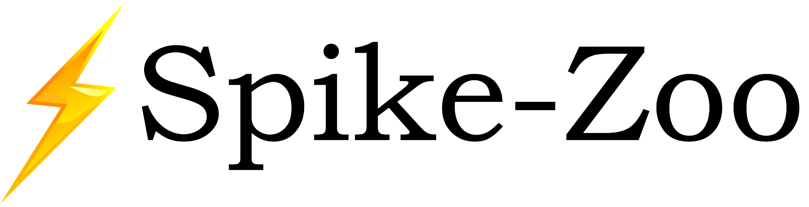

<h5 align="center">

[](https://github.com/chenkang455/Spike-Zoo/stargazers) [](https://github.com/chenkang455/Spike-Zoo/issues) <a href="https://badge.fury.io/py/spikezoo"></a> [](https://github.com/chenkang455/Spike-Zoo)
    
<p>
<p align="center">
    <a href="https://spike-zoo.readthedocs.io/zh-cn/latest/#">
        </a>
</p>

<!-- <h2 align="center"> 
  <a href="">⚡Spike-Zoo: 
  </a>
</h2> -->

## 📖 About
⚡Spike-Zoo is the go-to library for state-of-the-art pretrained **spike-to-image** models designed to reconstruct images from spike streams. Whether you're looking for a simple inference solution or aiming to train your own spike-to-image models, ⚡Spike-Zoo is a modular toolbox that supports both, with key features including:

- Fast inference with pre-trained models.
- Training support for custom-designed spike-to-image models.
- Specialized functions for processing spike data.


## 🚩 Updates/Changelog
* **25-02-02:** Release the `Spike-Zoo v0.2` code, which supports more methods, provide more usages like training your method from scratch.
* **24-07-19:** Release the `Spike-Zoo v0.1` code for base evaluation of SOTA methods.

## 🍾 Quick Start
### 1. Installation
For users focused on **utilizing pretrained models for spike-to-image conversion**, we recommend installing SpikeZoo using one of the following methods:

* Install the last stable version `0.2.3` from PyPI:
```
pip install spikezoo
```
*  Install the latest developing version `0.2.3` from the source code **(recommended)**:
```
git clone https://github.com/chenkang455/Spike-Zoo
cd Spike-Zoo
python setup.py install
```

For users interested in **training their own spike-to-image model based on our framework**, we recommend cloning the repository and modifying the related code directly.
```
git clone https://github.com/chenkang455/Spike-Zoo
cd Spike-Zoo
python setup.py develop
```

### 2. Inference 
Reconstructing images from the spike is super easy with Spike-Zoo. Try the following code of the single model:
``` python
from spikezoo.pipeline import Pipeline, PipelineConfig
import spikezoo as sz
pipeline = Pipeline(
    cfg=PipelineConfig(save_folder="results",version="v023"),
    model_cfg=sz.METHOD.BASE,
    dataset_cfg=sz.DATASET.BASE 
)
pipeline.infer_from_dataset(idx = 0)
```


### 3. Training
We provide a user-friendly code for training our provided `BASE` model (modified from the `SpikeCLIP`) for the classic `REDS` dataset introduced in `Spk2ImgNet`:
``` python
from spikezoo.pipeline import TrainPipelineConfig, TrainPipeline
from spikezoo.datasets.reds_base_dataset import REDS_BASEConfig
from spikezoo.models.base_model import BaseModelConfig
pipeline = TrainPipeline(
    cfg=TrainPipelineConfig(save_folder="results", epochs = 10),
    dataset_cfg=REDS_BASEConfig(root_dir = "spikezoo/data/reds_base"),
    model_cfg=BaseModelConfig(),
)
pipeline.train()
``` 
We finish the training with one 4090 GPU in `2 minutes`, achieving `32.8dB` in PSNR and `0.92` in SSIM.

> 🌟 We encourage users to develop their models with simple modifications to our framework. 


### 4. Model Usage
We also provide a direct interface for users interested in taking the spike-to-image model as a part of their work:

```python 
import spikezoo as sz
from spikezoo.models.base_model import BaseModel, BaseModelConfig
# input data
spike = sz.load_vidar_dat("data/data.dat", width=400, height=250, out_format="tensor")
spike = spike[None].cuda()
print(f"Input spike shape: {spike.shape}")
# net
net = BaseModel(BaseModelConfig(model_params={"inDim": 41}))
net.build_network(mode = "debug")
# process
recon_img = net(spike)
print(recon_img.shape,recon_img.max(),recon_img.min())
```

### 5. Spike Utility
We provide a faster `load_vidar_dat` function implemented with `cpp` (by [@zeal-ye](https://github.com/zeal-ye)):
``` python
import spikezoo as sz
spike = sz.load_vidar_dat("data/scissor.dat",width = 400,height = 250,version='cpp')
```
Experiments show that the `cpp` version is more than 10 times faster than the `python` version.

The above are some basic usages of `Spike-Zoo`. For more detailed usage, please refer to the [Tutorials](https://spike-zoo.readthedocs.io/zh-cn/latest/#).


## 📅 TODO
- [x] Support the overall pipeline for spike simulation. 
- [x] Provide the tutorials.
- [ ] Support more training settings.
- [ ] Support more spike-based image reconstruction methods and datasets. 

## ✨‍ Acknowledgment
Our code is built on the open-source projects of [SpikeCV](https://spikecv.github.io/), [IQA-Pytorch](https://github.com/chaofengc/IQA-PyTorch), [BasicSR](https://github.com/XPixelGroup/BasicSR) and [NeRFStudio](https://github.com/nerfstudio-project/nerfstudio).We appreciate the effort of the contributors to these repositories. Thanks for [@ruizhao26](https://github.com/ruizhao26), [@shiyan_chen](https://github.com/hnmizuho) and [@Leozhangjiyuan](https://github.com/Leozhangjiyuan) for their help in building this project.

## 📑 Citation
If you find our codes helpful to your research, please consider to use the following citation:
```
@misc{spikezoo,
  title={{Spike-Zoo}: Spike-Zoo: A Toolbox for Spike-to-Image Reconstruction},
  author={Kang Chen and Zhiyuan Ye and Tiejun Huang and Zhaofei Yu},
  year={2025},
  howpublished = "[Online]. Available: \url{https://github.com/chenkang455/Spike-Zoo}"
}
```