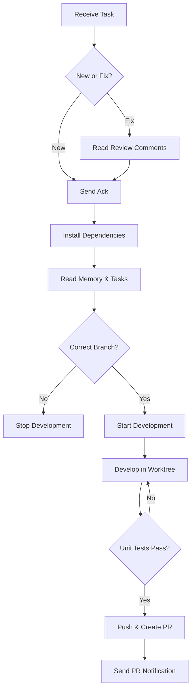

# SpikeZoo Development Guide

This guide provides comprehensive instructions and standards for developing models and features in SpikeZoo.

## Table of Contents

1. [Getting Started](#getting-started)
2. [Development Workflow](#development-workflow)
3. [Code Standards](#code-standards)
4. [Testing](#testing)
5. [Documentation](#documentation)
6. [Model Development](#model-development)
7. [Pipeline Development](#pipeline-development)
8. [Contributing](#contributing)

## Getting Started

### Prerequisites

- Python 3.8+
- PyTorch 1.10+
- Required dependencies (see `requirements.txt`)

### Environment Setup

```bash
# Clone the repository
git clone https://github.com/your-org/spikezoo.git
cd spikezoo

# Create virtual environment
python -m venv venv
source venv/bin/activate  # On Windows: venv\Scripts\activate

# Install dependencies
pip install -r requirements.txt
```

### Development Tools

Recommended development tools:

- IDE: VS Code or PyCharm
- Linter: flake8
- Formatter: black
- Type checker: mypy

## Development Workflow

### Branching Strategy

Follow the GitFlow branching strategy:

- `main`: Production-ready code
- `develop`: Integration branch for features
- `feature/task-{id}`: Feature branches for specific tasks
- `hotfix/*`: Emergency fixes for production
- `release/*`: Release preparation branches

### Task Assignment

Tasks are assigned through the orchestrator system:

1. Receive task assignment with payload
2. Acknowledge receipt immediately
3. Follow the development state machine
4. Commit and push changes
5. Create pull request for review

### Development State Machine



## Code Standards

### Python Style Guide

Follow PEP 8 with these additional conventions:

#### Naming Conventions

```python
# Classes: PascalCase
class BaseModel:
    pass

# Functions: snake_case
def load_network():
    pass

# Variables: snake_case
model_config = {}

# Constants: UPPER_SNAKE_CASE
DEFAULT_BATCH_SIZE = 32

# Private members: leading underscore
def _private_method():
    pass
```

#### Imports

```python
# Standard library imports
import os
import sys
from typing import Optional, Dict

# Third-party imports
import torch
import numpy as np

# Local imports
from spikezoo.models.base_model import BaseModel
from spikezoo.utils import load_network
```

#### Documentation

Use Google-style docstrings:

```python
def example_function(param1: str, param2: int = 10) -> bool:
    """Example function with docstring.
    
    Args:
        param1: The first parameter.
        param2: The second parameter. Defaults to 10.
        
    Returns:
        True if successful, False otherwise.
        
    Raises:
        ValueError: If param1 is invalid.
        
    Example:
        >>> example_function("test", 5)
        True
    """
    if not param1:
        raise ValueError("param1 cannot be empty")
    return True
```

### Type Hints

Always use type hints for function signatures:

```python
from typing import Optional, Dict, List, Tuple
import torch.nn as nn

def process_model(model: nn.Module, config: Dict[str, any]) -> Optional[nn.Module]:
    """Process a model with given configuration.
    
    Args:
        model: PyTorch model to process
        config: Configuration dictionary
        
    Returns:
        Processed model or None if processing failed
    """
    # Implementation here
    return model
```

## Testing

### Test Organization

Tests should mirror the source code structure:

```
spikezoo/
├── models/
│   ├── base_model.py
│   └── ...
├── tests/
│   ├── test_base_model.py
│   └── ...
```

### Unit Testing

Use unittest framework for unit tests:

```python
import unittest
import torch
from spikezoo.models.base_model import BaseModel, BaseModelConfig

class TestBaseModel(unittest.TestCase):
    """Unit tests for BaseModel."""
    
    def setUp(self):
        """Set up test fixtures."""
        self.config = BaseModelConfig(model_name="test_model")
    
    def test_initialization(self):
        """Test model initialization."""
        model = BaseModel(self.config)
        self.assertEqual(model.cfg, self.config)
        self.assertIsNone(model.net)
    
    def test_model_creation(self):
        """Test model creation with proper configuration."""
        model = BaseModel(self.config)
        self.assertIsInstance(model, BaseModel)

if __name__ == '__main__':
    unittest.main()
```

### Integration Testing

For integration tests, test the complete workflow:

```python
def test_full_training_cycle(self):
    """Test complete training cycle."""
    # Setup
    model = create_model("test_model")
    dataset = create_dataset("test_dataset")
    
    # Execute
    result = model.train(dataset, epochs=1)
    
    # Assert
    self.assertIsNotNone(result)
    self.assertTrue(model.is_trained())
```

### Test Coverage

Aim for >90% test coverage for critical components. Use coverage.py:

```bash
coverage run -m unittest discover
coverage report
coverage html
```

## Documentation

### Inline Documentation

Document all public APIs with comprehensive docstrings.

### README Files

Each major component should have a README.md explaining:

- Purpose and usage
- Installation requirements
- Configuration options
- Examples

### Examples

Provide practical examples for common use cases:

```python
# examples/basic_usage.py
"""Basic usage example for SpikeZoo."""

from spikezoo.models import create_model
from spikezoo.datasets import create_dataset

def main():
    # Create model
    model = create_model("base")
    
    # Load dataset
    dataset = create_dataset("example_dataset")
    
    # Process data
    results = model.process(dataset)
    
    print(f"Processed {len(results)} samples")

if __name__ == "__main__":
    main()
```

## Model Development

### Directory Structure

Follow the model structure standard (see `model_structure.md`).

### Model Interface

All models must inherit from `BaseModel`:

```python
from spikezoo.models.base_model import BaseModel, BaseModelConfig

class CustomModel(BaseModel):
    """Custom model implementation."""
    
    def __init__(self, cfg: BaseModelConfig):
        super().__init__(cfg)
    
    def build_network(self, mode: str = "train", version: str = "local"):
        """Build the network."""
        # Implementation
        return self
    
    def spk2img(self, spike):
        """Convert spikes to images."""
        return self.net(spike)
```

### Configuration

Define model-specific configurations:

```python
from dataclasses import dataclass
from spikezoo.models.base_model import BaseModelConfig

@dataclass
class CustomModelConfig(BaseModelConfig):
    """Configuration for CustomModel."""
    
    # Model-specific parameters
    hidden_dim: int = 128
    num_heads: int = 8
    
    # Override defaults if needed
    model_file_name: str = "nets"
    model_cls_name: str = "CustomNet"
```

### Registration

Register models with the global registry:

```python
from spikezoo.models.model_registry import register_model

register_model("custom_model", CustomModel, CustomModelConfig)
```

## Pipeline Development

### Pipeline Interface

Pipelines should inherit from base pipeline classes:

```python
from spikezoo.pipeline.base_pipeline import Pipeline, PipelineConfig

class CustomPipeline(Pipeline):
    """Custom pipeline implementation."""
    
    def __init__(self, cfg: PipelineConfig, model_cfg, dataset_cfg):
        super().__init__(cfg, model_cfg, dataset_cfg)
    
    def process(self):
        """Process pipeline logic."""
        # Implementation
        pass
```

### Configuration

Define pipeline-specific configurations:

```python
from dataclasses import dataclass
from spikezoo.pipeline.base_pipeline import PipelineConfig

@dataclass
class CustomPipelineConfig(PipelineConfig):
    """Configuration for CustomPipeline."""
    
    # Pipeline-specific parameters
    batch_size: int = 32
    num_workers: int = 4
```

## Contributing

### Pull Request Process

1. Fork the repository
2. Create feature branch
3. Implement changes
4. Add tests
5. Update documentation
6. Submit pull request

### Code Review

All pull requests require review:

- At least one approval from core team
- All tests must pass
- Code coverage requirements met
- Documentation updated

### Issue Reporting

Report issues with:

- Clear title describing the problem
- Steps to reproduce
- Expected vs actual behavior
- Environment information
- Relevant logs or screenshots

## Continuous Integration

### Automated Checks

CI pipeline includes:

- Code style enforcement (flake8)
- Type checking (mypy)
- Unit tests execution
- Test coverage verification
- Security scanning

### Deployment

Production deployments:

- Tagged releases
- Automated testing
- Gradual rollout
- Monitoring and alerts

## Security

### Code Security

- Regular security audits
- Dependency vulnerability scanning
- Secure coding practices
- Access control reviews

### Data Protection

- Privacy by design
- Data encryption at rest and in transit
- Access logging and monitoring
- Compliance with regulations

## Performance

### Optimization Guidelines

- Profile before optimizing
- Focus on bottlenecks
- Consider memory usage
- Test performance impact

### Monitoring

- Performance metrics collection
- Resource utilization tracking
- Error rate monitoring
- User experience measurement

## Support

### Getting Help

- Check documentation first
- Search existing issues
- Join community discussions
- Contact maintainers for urgent issues

### Community Guidelines

- Be respectful and inclusive
- Provide constructive feedback
- Help others when possible
- Follow code of conduct

This guide is living documentation. Contributions to improve it are welcome!